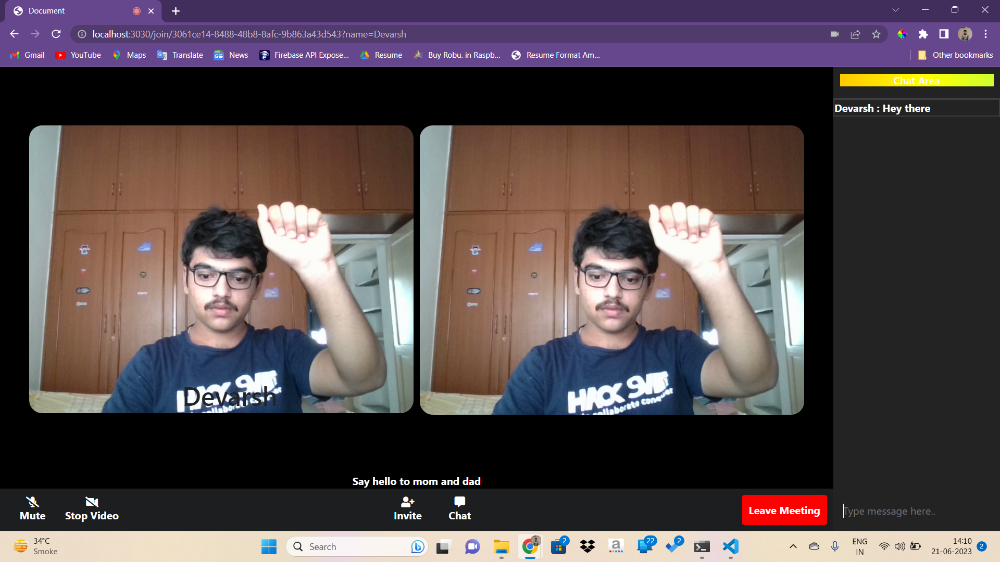

Real-time sign language detection system in video calling web-app

Tech Stack:
Frontend:
Javascript
HTML/CSS

Backend:
NodeJS
ExpressJS
Socket.io (Websockets)
PeerJS

ML
Mediapipe
TensorflowJS

Training and Data Collection script can be found in ML folder